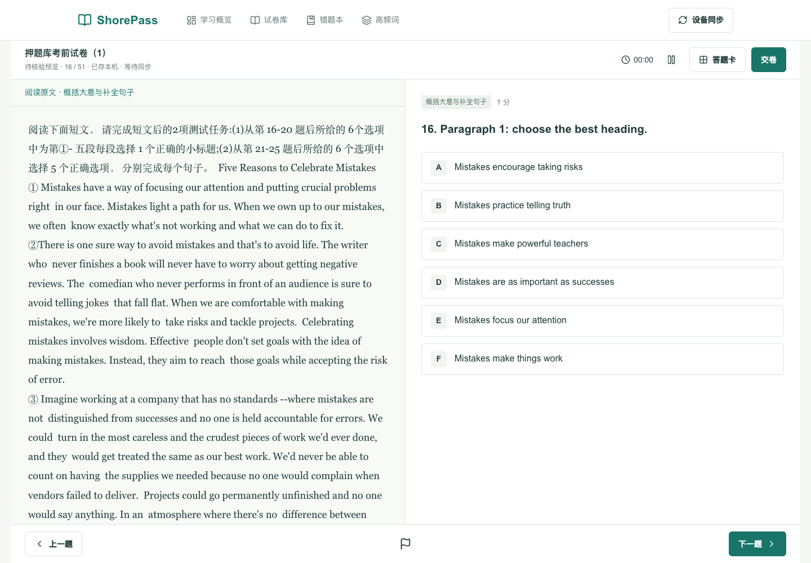
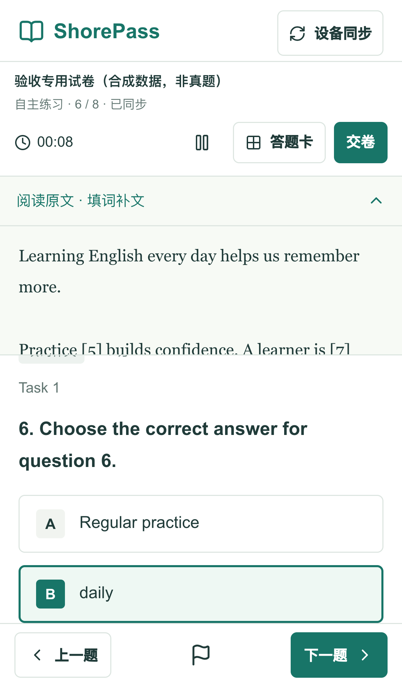
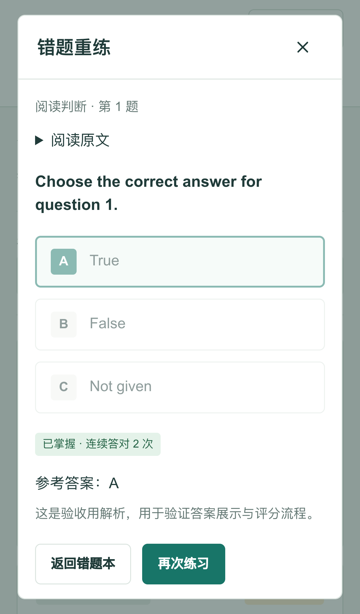

# ShorePass 验收与修复报告

日期：2026-09-10  
依据：`../自考英语真题库产品需求文档_PRD.md`，其中 12A 修订规则优先于前文冲突规则。  
目标：电脑、手机网页做英语题，自动保存错题并支持复习。  
项目：Next.js 15 + React 19 + Prisma 5 + SQLite，沿用现有技术栈。

## 1. 验收结论

**核心软件流程已修复并通过本地生产版本验收；正式真题上线仍被题库核验阻塞。尚未部署到公网。**

- 可以使用电脑网页或手机尺寸页面做题、保存进度、交卷、查看解析、积累错题、重复复习。
- 设备通过一次性同步码绑定后，服务端记录互通；答题约 4 秒同步，概览与错题约 5 秒刷新。
- 88 项单元测试通过；8 项桌面/手机核心端到端用例通过；4 项边界用例通过，共 12 项端到端用例。
- 生产构建、ESLint、TypeScript 检查通过。没有继续沿用原来的“忽略构建类型错误”设置。
- 当前只有一套修复后的 51 题押题卷预览。完整人工核验的正式卷为 **0 套**，不能宣称满足 PRD 的“至少 1–2 套高质量核验卷”。

试用地址：<http://127.0.0.1:3210>。该地址只在当前电脑上可访问。电脑休眠或服务进程停止后不可访问。

## 2. 发现并修复的问题

| 优先级 | 原问题与影响 | 修改结果 |
| --- | --- | --- |
| P0 | 错题页查询所有用户记录，存在数据混用 | 统一设备身份认证，错题、成绩、保存与交卷均校验所属用户 |
| P0 | 直接相信请求中的 userId，保存接口不校验试卷归属 | HttpOnly 设备凭证；拒绝越权会话和跨卷题目 |
| P0 | 通用同步接口允许客户端写会话、成绩和他人记录 | 停用旧任意写入接口；答案仅通过受校验的保存/交卷接口进入 |
| P0 | 每次答题仅请求服务器，断网没有本地答案副本 | 答案、标记、题号、本地计时写入本机，重连重试上传 |
| P0 | 先显示“已交卷”再发请求，失败后没有可靠恢复 | 服务器确认后才展示结果；失败保留本地作答并允许重试 |
| P0 | 判分逐条非事务写入，重复提交报错、可能半完成 | 保存、判分、错题更新和会话结算采用事务；重复交卷返回原结果 |
| P0 | 仅检查试卷级 verified，测试卷也可进入模考 | 核验防线增加逐题状态、原文、选项、答案匹配、来源页码与争议检查 |
| P1 | “重新练习”只是没有行为的按钮 | 完成真实重练弹窗、判分、解释、巩固和掌握状态更新 |
| P1 | 原错题逻辑将普通整卷重复提交也计为掌握 | 只有独立复练提交增加连对次数；重复请求去重，重错归零，版本变化归零 |
| P1 | 手机端隐藏了全部导航，无法方便进入错题本 | 增加移动端完整导航和当前页面状态 |
| P1 | 桌面答题仍是窄列，手机整屏高度加顶部导航导致遮挡 | 桌面左右双栏；手机动态视口高度、折叠原文和固定底栏 |
| P1 | 填句/填词没有使用 section 选项池，概括大意缺少正确选项 | 统一答案输入控件；题目级选项优先，共享选项池兜底 |
| P1 | 作文待评时仍显示客观题分数作为预估总分 | 总分显示待评，保留作文作答和示例范文，不判定不及格 |
| P1 | 倒计时逐秒递减，过期旧会话直接“提交”但没判分 | 模考按持久截止时间与服务器时间校准；过期恢复同一会话并正常结算 |
| P1 | 练习也强制 150 分钟截止；暂停按钮状态不完整 | 练习不因模考截止时间失效，支持暂停与继续 |
| P1 | 跨设备旧草稿可覆盖更新内容 | revision 乐观锁拒绝旧版本，冲突时保留本机备份并明确提示 |
| P1 | 同步码未校验生成者身份，消费非原子，使用 Math.random | 认证生成、密码学随机数、限时一次性消费事务、设备令牌绑定与尝试限流 |
| P1 | 发布与评分管理接口未鉴权 | 要求服务端 ADMIN_TOKEN；未配置即拒绝；评分校验范围与题目类型 |
| P1 | 高频词“认识/不认识”没有存储 | 增加服务端词汇进度接口，保存后更新状态 |
| P2 | 缺少学习概览、历史入口和试卷完成统计 | 增加概览、继续作答、历史结果及最高/最近客观分统计 |
| P2 | 有效试卷与测试、示例、占位内容混在一张宽表中 | 移动适配列表，筛选中文化，学习列表隐藏测试和占位卷 |
| P2 | 再次练习可能不断回到已提交的旧结果 | 支持新会话入口，同时保留历史会话独立结果地址 |
| P2 | 缺少安装清单、图标与离线页面缓存 | 增加 Web Manifest、PNG 图标、Service Worker；只缓存公开页面和静态资源 |
| P2 | PDF 提取保留逐行换行，原文产生不自然短行 | 显示层合并软换行，保留段落标记与缩进段落，不修改来源文本 |

## 3. 题库内容修复

检查发现原有数据同时包含真实整理稿、示例卷、占位卷和测试卷，不能把数据库记录数量等同于可用真题数量。

本次依据已存在的 `整理后的试卷库/押题库考前试卷（1）.md`，修复押题卷（1）的结构化录入缺陷：

- 补回第 11 题四个真实选项，修复填句补文中缺失、截断的句子选项。
- 将概括大意的两组选项分别绑定到对应题目，避免重复 A–F 键覆盖。
- 补回第 16–25 题可辨认的题干和完成句子，替换“见短文原文”占位文字。
- 统一填空位置为 `[题号]`，补齐完形补文原形词，支持定位当前空位。
- 修复答案“详见解析”、希腊字母 Α/Β、漏失的第 35 题答案等提取错误；保留 originalAnswer 与修订说明。
- 原稿第 24 题明确写明 C/F 两项相同：保留争议，不自动判分、不错误增加掌握次数。
- 保留 `verified=false`；没有伪造原 PDF 页码、人工校订记录或“已核验”结论。
- 保留原始 `paper1.json`，另导出可复用的修复数据 `prisma/seed-data/repaired-preview-20260910.json`。

修复脚本：`src/scripts/repair-preview.ts`。修复使用事务，记录 PaperVersion，并可检测是否已应用，防止重复执行。

**仍需要人工逐页对照原 PDF，确认文章 OCR、题干、答案、页码和授权使用范围。整理稿核对不能替代原件人工核验。**

## 4. PRD 对照

| 要求 | 状态 | 说明 |
| --- | --- | --- |
| 年份、地区、课程、卷型筛选 | 通过 | 支持重置和空结果状态 |
| 电脑/手机答题 | 通过 | Chromium 桌面与手机模拟，另检查 320px 小屏 |
| 单题切换、答题卡、标记 | 通过 | 刷新后保留答案、当前题与标记 |
| 7 大题型基础作答 | 通过 | 客观选项、选项池、变形词输入、作文输入和单词计数 |
| 完形空格、大小写、拼写变体 | 通过 | 独立判分单测与接口验收 |
| 模考计时、超时结算 | 通过 | 服务端截止时间；正式模考不提供暂停 |
| 本地草稿和恢复 | 通过（有条件） | 已访问缓存页面可离线刷新；未访问过的页面首次仍需网络 |
| 交卷结果、题型明细、错题过滤 | 通过 | 使用明细进度条；没有新增雷达图 |
| 错题保存与复练闭环 | 通过 | 未掌握 → 巩固中 → 已掌握；重错和版本变化重置 |
| 设备间记录、成绩与错题互通 | 通过 | 输入一次性同步码绑定；采用轮询同步，不是 WebSocket 推送 |
| 扫码配对 | 未实现 | 当前只有输入同步码 |
| 高频词进度 | 通过 | API 写入、读取验证；断网保存失败会停留当前词等待重试 |
| 原文定位 | 部分 | 支持已有 `[题号]` 空位定位高亮；未建立全部阅读题的语义段落映射 |
| 题型专项独立组卷 | 未实现 | 可以答题卡跳转和错题按题型筛选；没有独立组卷模式 |
| 管理导入与发布校验 | 部分 | 保留 JSON 导入和校验 API；没有完成左右分屏原件校对后台 |
| 1–2 套完整正式核验卷 | 未通过，阻塞正式上线 | 目前只有 51 题押题卷预览，0 套完整正式核验卷 |
| 作文 AI 批改、模板拆解 | 未接入 | 不展示虚构 AI 分数；保存、参考示例和人工评分接口可用 |
| PWA 安装与离线 | 基础实现通过 | 生产构建缓存验证通过；未做真实 iPhone Safari 安装测试 |
| 暗色 / 护眼模式 | 未实现 | 目前使用统一浅色阅读界面 |
| 公网部署 | 未执行 | 用户尚未选择平台；未开通、付费或发布任何外部服务 |

## 5. 验证记录

### 自动化结果

| 检查 | 结果 |
| --- | --- |
| `npm test` | 88 项通过 |
| `npm run lint` | 通过，无错误或警告 |
| `NEXT_DIST_DIR=.next-production npm run build` | 通过，包含 ESLint 和 TypeScript 检查 |
| `playwright.acceptance.config.ts` 核心 + 韧性用例 | 桌面/手机合计 8 项通过 |
| `boundaries.spec.ts` | 桌面/手机合计 4 项通过 |

验收数据使用独立数据库 `/tmp/shorepass-acceptance-20260910.db`，合成试卷只存在于该库，不向正式题库冒充真题。合成卷覆盖全部 7 种题型、8 道题和两组不同的概括大意任务，用来验证题量动态读取。

覆盖：未登录拒绝、用户隔离、跨卷题目拒绝、草稿版本冲突、重复交卷、客观判分、主观待评、错题去重、两次掌握、重错归零、配对消费、配对过期、模考过期、词汇持久化、手机折叠原文、离线刷新、重连补传、交卷失败、暂停继续、再次练习、弹窗 Escape 关闭。

### UI 证据

桌面视口为 1440×1000；手机采用 iPhone 13 尺寸的 Chromium 模拟；另检查 320×640。所有核心测试页面未发现横向溢出，答题底部导航位于可视范围内。

首张截图来自修复后的真实押题卷预览，手机截图使用合成验收数据。真实手机浏览器、软键盘、Safari 安装行为、长时间休眠、弱网极端情况和公网 TLS/代理部署仍需在选定环境验证。

## 6. 数据保留与运维

- 修改前通过 SQLite backup 接口备份到 `/tmp/shorepass-before-audit-20260910.db`。
- 该备份另保留在工作区 `/Users/mubai/英语/ShorePass-audit-backup-20260910.db`，避免只依赖临时目录。备份含历史数据，不应上传到公开仓库。
- 现有数据库未清空；表结构只增加草稿状态与版本字段。
- 没有把旧版任意 userId 自动认领给访问者。旧记录保留，但缺少有效设备凭证的记录需要管理员核实归属后迁移。
- 冲突草稿会另存浏览器本机备份；清理浏览器可能删除尚未上传的草稿。
- `/tmp` 是临时位置，不应作为长期备份策略。正式上线应采用持久盘和异地多版本备份。
- 自动审批拒绝把现有数据库服务开放到整个局域网，理由是可能将真实数据暴露给同一 Wi-Fi 的其他设备。最终试用服务仅监听 `127.0.0.1`；没有绕过该限制。

## 7. 关于 GitHub Pages 的建议

GitHub Pages 可以托管纯静态 H5，并用 localStorage/IndexedDB 记住当前浏览器的记录；但电脑和手机不自动互通，清理浏览器会丢失本地记录，而且当前 Next.js 服务端 API 无法在 Pages 运行。

**对你目前一个人使用的需求，推荐单实例 Node.js + 持久 SQLite + HTTPS。** 选择小服务器或支持持久卷的托管服务即可。若以后希望免维护，可以迁移到 Vercel + Supabase/PostgreSQL，但这需要数据库改造和重新测试，不能直接上传当前 SQLite 文件。

平台尚未确定，本次不替你购买、注册或部署。具体步骤、身份找回边界和备份方法见 `DEPLOYMENT.md`。

## 8. 最后剩下什么

1. 人工核验至少一套完整真实试卷，补齐准确页码并解决争议，再开放正式模考。
2. 选定服务器或托管平台，配置 HTTPS、持久磁盘、备份及公网入口限流。
3. 用实际手机完成软键盘、浏览器切换、后台恢复和安装测试。
4. QR 配对、AI 作文批改、专门题型组卷和校对后台可按学习需要继续迭代。

因此，本次交付是“已修复并验证的个人学习网站软件 + 可用预览题库”，不是“已经拥有完整核验真题并上线公网的最终产品”。
